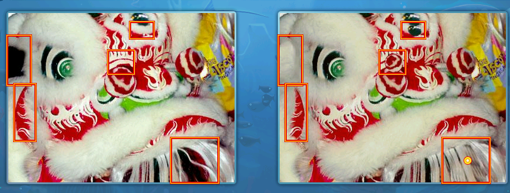
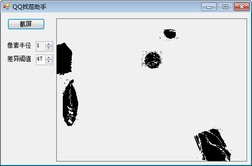

## 说明

qq游戏：大家来找茬的辅助

## 一些信息

游戏窗口大小：1024×768

图片大小：381×286

右图比左图增加了一层东西，看似更暗一些

case1:

左图 248 252 248

右图 232 232 224

case 2:

左图 224 120 152

右图 216 112 136

摸不清什么规律，所以计算相同位置的像素颜色距离，距离超过一定阈值，认为是不同色

## 示意图

